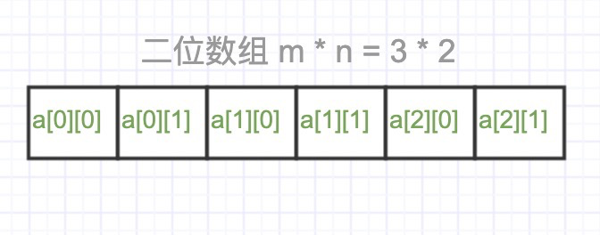

### 什么是数组？

是一种线性表数据结构。

+ 内存空间是连续的
+ 存储相同的数据类型

### 线性表

+ 数据排成像一条线一样的结构，最多只有两个方向前后
+ 栗子：链表、队列、栈
+ 非线性表：二叉树、堆、图

### 数组的特点

+ 下标从0开始

  为什么？

  + 历史原因，c的数据是从0开始的

  + 减少cpu指令计算。如果是从1开始，计算访问某个index的内存地址，就变成了

    `a[k]_address = base_address + （k-1） * data_type_size`

    其中(k-1)是比原来多的运算

+ 可以随机访问

  + 一维：`a[i]_address = base_address + i * data_type_size`

  + 二维：m*n的二维数组 `a[i][j]= base_address + (i*n+j) * data_type_size`

    

### 数组操作的复杂度分析

#### 查

+ 根据下标访问数组的元素，时间复杂度是O(1)
+ 用二分法查找某个元素，在排好序的数组中，时间复杂度O(logn)

#### 增

+ 最好时间复杂度：O(1)
+ 最坏时间复杂度：O(n) 
+ 平均时间复杂度：O(n)

#### 删

+ 最好时间复杂度：O(1)
+ 最坏时间复杂度：O(n) - 需要保证连续的空间，就得移动元素
+ 平均时间复杂度：O(n)
+ 改进
  + 具体做法：标记需要删除的元素，在没有可以使用的空间时候，统一删除移动元素
  + 类比 JVM 的标记清除 和 标记整理算法

### 对比容器

对于Java ArrayList来说

1. 对使用者隐蔽了底层的细节操作，方便使用，比如动态扩容
2. 容器不支持基本数据类型，Autoboxing、Unboxing 有性能损耗
3. 多维数组时候，数组更直观

#### 问题

1. 数组是什么？
2. 数组的特点有哪些？
3. 数组中数据的查找一定是 O(1) 吗？
4. 容器和数组有什么区别，容器可以完全替代数组吗？

