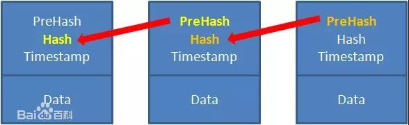
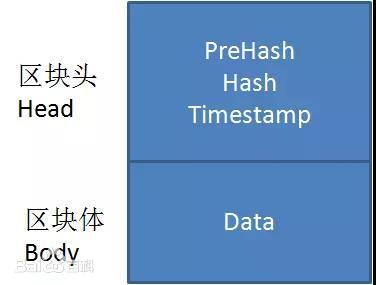

### 什么是哈希算法？

1. 概念

   也称单向哈希算法，将任意长度的二进制值串映射为**固定长度**的二进制数值串，映射之后的数据为哈希值

2. 哈希算法的要求

   + 执行效率高，源数据就算再长也希望快速完成计算

   + 哈希值不能反推出源值 -- 单向哈希
   + 哈希冲突的概率要小
   + 对源数据敏感，哪怕一个bit不同，得到的哈希值也不能相同

3. 应用

   + 安全加密
   + 数据校验
   + 唯一标识
   + 散列函数
   + 负载均衡
   + 数据分片
   + 分布式存储

### 安全加密

1. 常用的哈希加密算法：MD5、AES、SHA、DES
2. 哈希算法加密，并不能保证数据完全安全
   + 鸽巢理论(抽屉理论) ——10个鸽巢11个鸽子，肯定有一个鸽巢中鸽子的数量大于等于2个
   + MD5 生成 128位二进制串，冲突的概率小于 1/(2^128)
3. 没有绝对安全的加密算法，越复杂、越难破解的加密算法，计算的时间成本也会变大，根据安全性和计算时间选择使用时做权衡。

### 唯一标识

1. 将源数据通过哈希算法生成哈希值并保存，对比哈希值判断是否存在
2. 比较大的对象如图片，可截取二进制部分数据，进行哈希计算，通过对比可判断。如果更加严谨一些，还可以在上一步之后，如果发现哈希值一样，那么再进行全量对比。

### 数据校验

校验数据的完整性和正确性。

例如：BT 下载时，对各文件块进行哈希计算，之后和种子文件中正确的哈希值比对，及时发现文件块不完整和被篡改了

### 散列函数

比较看重散列的平均性和哈希算法的执行效率。一般使用较简单的散列算法，追求效率

### 问题

1. 区块链使用的是哪种算法，目的是什么?

   一个区块，是由区块头和区块体组成。

   区块头里面包含了上一个区块的Hash和本区块的Hash和时间戳。

   因为这种链式关系和哈希值的唯一性，只要区块链上任意一个区块被修改过，后面所有区块保存的哈希值就不对了。

   哈希算法使用的是SHA256算法，计算非常耗时，如果一个区块的Hash被篡改，就必须一同篡改后面的所有区块，短时间不可能做到

   

   

