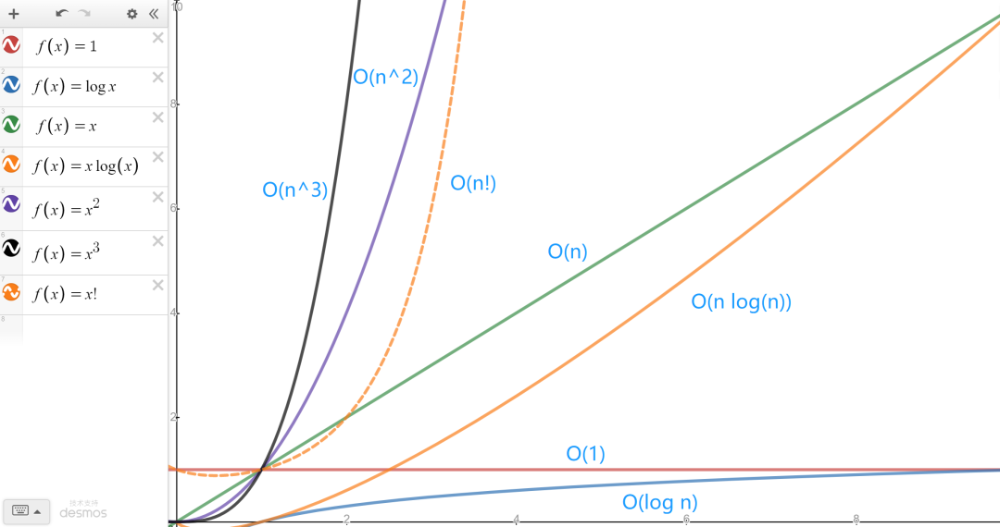

### 复杂度分析

#### 说明

+ 从“快”和“省”两个维度（即时间和空间），对算法代码的执行效率进行评估。
+ 复杂度包括：时间复杂度和空间复杂度。
+ 复杂度的具体描述是，算法的执行时间（或占用空间）与数据规模增长的关系。

#### 和性能测试的区别

它不依赖具体硬件环境和具体数据规模，就可以对代码的执行效率有大概的评估

### 为什么要做复杂度分析？

通过评估代码执行效率，帮助我们编写更优质的代码，降低系统的开发和维护成本

### 复杂度具体分析内容

#### 大O表示法

以时间复杂度为例

T(n) = O(f(n)) - 代码的执行时间和每行代码的执行次数成正比

+ T(n) - 代码运行总时间
+ f(n) -每行代码运行总次数
+ n - 数据规模

#### 时间复杂度

+ 说明：代码执行时间随数据规模增长的变化趋势

+ 特点：忽略对变化趋势不作为决定性影响因素：常量、低阶、系数

+ 求复杂度的具体方法

  + 单段代码看高频：关注循环次数最多一行代码
  + 多段代码取最大：取量级最大代码段的复杂度
  + 嵌套代码求乘积
  + 多个规模求加乘：多个多段求加法，多个嵌套求乘积

+ 常见

  + 多项式
    + 常量阶 O(1)
    + 对数阶 O(logn)
    + 线性阶 O(n)
    + 线性对数阶 O(nlogn)
    + 平方阶 O(n^2) 、立方阶 O(n^3) ... k 次方阶 O(n^k)
  + 非多项式：低效算法
    + 指数阶 O(2^n)
    + 阶乘阶 O(n!)
  
  
  

#### 空间复杂度

+ 代码执行占用空间随数据规模的变化趋势
+ 常见：O(1)、O(n)、O(n2 )

### 问题回顾

1. 什么是复杂度？

2. 做复杂度分析有什么用？

3. 怎么做复杂度分析？

4. 如何掌握好复杂度分析？

   复杂度分析并不难，关键在于多练